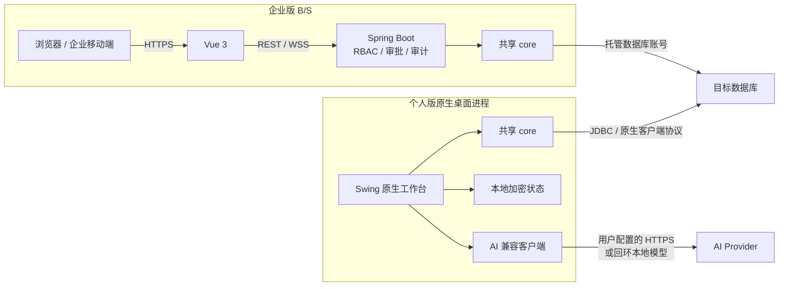

# 系统架构设计

> 当前产品定位为 [可私有化的可信 AI 数据智库](../docs/product/产品定位.md)；个人端、企业端和移动端继续保持本文所述独立运行时边界。

## 架构原则

个人版与企业版不是同一个网页程序的不同外壳：

- 个人版是原生 C/S 客户端，数据库驱动和连接对象位于桌面进程；
- 企业版是独立部署的 B/S 平台，浏览器只访问服务端 API；
- 两者仅共享可复用的 Java `core`，不共享运行时入口；
- 桌面发布链禁止启动浏览器、嵌入 WebView 或启动本地 HTTP 服务。

## 组件关系



## 模块职责

| 模块 | 职责 | 禁止事项 |
| --- | --- | --- |
| `core` | 驱动注册、动态下载、统一数据库接口、元数据 DTO、SQL 解析和审核 | 不依赖桌面 UI、REST Controller 或 JPA Repository |
| `desktop` | 原生 UI、个人连接生命周期、本地加密状态、个人 AI、jpackage | 不启动 Spring Boot，不包含 Vue，不启动浏览器/WebView/HTTP Server |
| `backend` | 企业认证、授权、审批、审计、托管连接和 REST/WS API | 不作为个人桌面 EXE 的启动入口 |
| `frontend` | 企业浏览器界面 | 不打包进个人桌面模块 |

## 个人版数据流

```text
用户操作
  → Swing 原生界面
  → SQL 审核与二次确认
  → 当前进程中的 DatabaseDriver
  → 目标数据库
  → QueryResult
  → 原生 JTable
```

每个活动连接持有独占锁，避免事务、目录切换和并发语句互相污染。执行任务具有独立 `executionId`，取消操作只定位当前语句。JDBC 连接支持显式开启事务、提交和回滚。

个人版状态位于 `%USERPROFILE%\.lyradb\desktop`：

- `desktop-state.json`：非敏感配置与加密后的凭据；
- `master.key`：随机本地主密钥，文件权限收紧到当前用户；
- `drivers/`：按需下载的数据库驱动；
- `logs/`：滚动日志，不记录密码、AI Key 或完整凭据连接串。

个人桌面端的连接编辑框默认遮蔽凭据，但设备用户可以主动显示或复制。复制后的值位于操作系统剪贴板，不再受 LyraDB 静态加密保护；界面会明确提示，日志仍禁止记录该值。

数据库密码与 AI Key 使用 AES-256-GCM、随机 IV 和认证标签。密钥与密文位于同一用户安全边界，因此这属于本地静态数据保护，不替代操作系统账户、磁盘加密和终端安全。

## 个人版 AI 边界

个人智库助手支持五类任务：生成、解释、修复、优化和安全审查 SQL。

1. 用户明确配置 Provider、Base URL、模型和 API Key；
2. LyraDB 只发送用户输入、当前 SQL 及用户提供的结构上下文；
3. 默认只允许 HTTPS；HTTP 仅允许回环本地模型；
4. 禁止重定向，API Key 只进入请求头且不写日志；
5. 响应只进入建议区或 SQL 编辑器，绝不自动执行。

LyraDB 不会仅凭字段名称推断业务口径。结构或定义不足时，AI 系统提示要求明确列出假设。

## 企业版数据流与安全

```text
浏览器 / 企业移动端
  → HTTPS / WSS
  → Spring Security Session + CSRF
  → Controller
  → Service 权限与事务
  → 托管 DatabaseDriver
  → 目标数据库
```

企业版使用工作空间 RBAC、资源归属校验、SQL AST、审批、一次性消费、脱敏和审计。生产数据库结构由 Flyway 演进，Hibernate 只做 `validate`。企业数据源账号必须在数据库侧落实最小权限。

## 发布门禁

Windows 原生包在 CI 与本地打包时必须真实运行 `LyraDB.exe --smoke-test=...`，并验证：

- `architecture=native-swing`；
- `browserLaunched=false`；
- `webViewEmbedded=false`；
- `localHttpServerStarted=false`；
- `aiConfigAvailable=true`；
- `driverCount=9`。

企业服务端 JAR 与个人桌面 ZIP 分别生成。旧的后端 B/S 桌面包装 profile 已禁用，误用时构建会失败。

<!-- last-updated: 2026-07-29 -->
